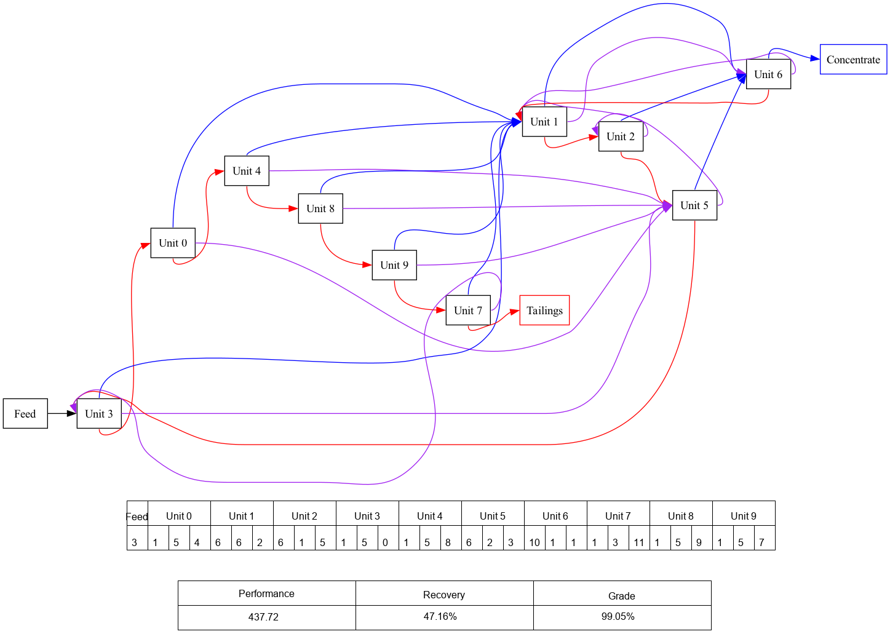
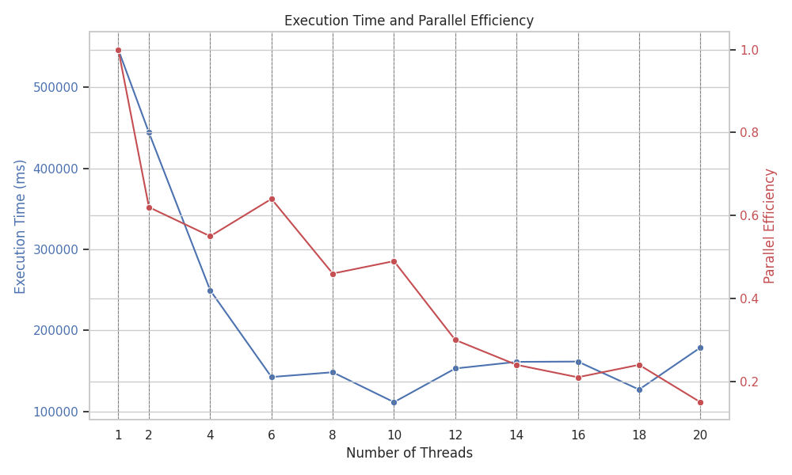

# 📋 Gerardium Rush

## 🔍 Overview

This project focuses on optimizing mineral recovery circuits using a Genetic Algorithm approach, specifically for extracting the valuable mineral "gerardium." By designing and evaluating various circuit configurations of separation units, the goal is to maximize recovery and purity of the final product while balancing economic considerations.

## 🚀 Getting Started
Follow these instructions to get the project up and running on your local machine. Detailed instructions can be found in the user manual in `./docs`.


## 📦 Installation

### 🗃️: Requirements

- **Operating System**: Linux/Unix-based system (recommended)

- **GCC Compiler**: gcc-13

  ```bash
  $ gcc --version   
  ```

- **CMake Version**: 3.10 or higher

  ```bash
  $ cmake --version  
  ```

- **Graphviz engine**: 2.47.3 or higher

  ```bash
  $ dot -V
  ```

- **Python**: 3.9 or higher

  | Package    | Version   |
  | ---------- | --------- |
  | graphviz   | >= 0.20.1 |
  | numpy      | >= 1.24.3 |
  | matplotlib | >= 3.7.1  |
  | pandas     | >= 2.0.1  |
  | pillow     | >= 9.4.0  |
  | seaborn    | >= 0.12.2 |

### 🛠️ Clone the project

To get started, please clone the directory in your local machine.

```bash
    $ git clone https://github.com/ese-msc-2023/acs-gerardium-rush-ilmentite.git
```

Then, open the directory in your prefered terminal and execute the following command to create a folder for building.
```bash
    $ cd acs-gerardium-rush-ilmentite
```

### 🏗️  Build the project

Now try to build and run the project using the following command
```bash
    $ make
```

Extra commands:
```bash
    $ make clean
    $ make env
    $ make build
    $ make run
    $ make post
    $ make docs
```

## 📤 Output

The output of the project is visualized in the image below, showing the optimized circuit configuration for gerardium recovery:

<html>
    
</html>

<div align="center"><i>Figure: Optimized circuit configuration for maximum gerardium recovery using a Genetic Algorithm.</i></div>


### 🖧 Run on HPC (optional)

Configure the `./hpc_scripts/eval_openmp.pbs` file.

```sh
LOG_DIR="../logs/omp_logs"
OUTPUT_DIR="./output"
num_threads=(1 2 4 6 8 10 12 14 16 18 20)	# number of threads to run
```

Run the script directly

```bash
$ ./hpc_scripts/eval_openmp.pbs 
```

Or submit a new job

```bash
$ qsub ./hpc_scripts/eval_openmp.pbs
```

Results will be saved in `./logs` and `./plots` directories.


<div align="center"></div>

<div align="center"><i>Figure: Execution time and parallel efficiency of 42 units with 1~20 threads</i></div>

## ✍️  Authors

Ilmenite Team Member:
- Ding Lihao
- Ioannidis Chris
- Krymski Antony
- Petala Naya
- Shen Chenlin
- Wang Ruochun
- Wang Yue
- Yu Wenbo

Feel free to reach out to any team member for further assistance or inquiries.

## 📚Reference

<a id="[1]">[1]</a> GitHub and OpenAI, "GitHub Copilot," 2024. [Online]. Available: https://copilot.github.com.

